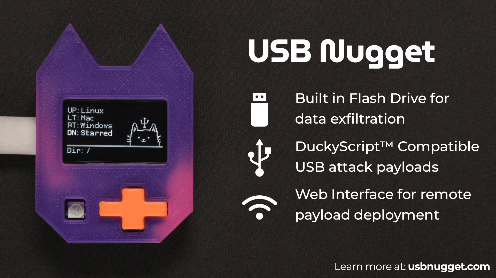

# **USB Nugget**: Cat-Themed USB Attacks
A versatile USB attack platform that lets you hack computers in seconds using a [USB Nugget](https://usbnugget.com)!  



## Resources:
- [USB Nugget Payloads](https://github.com/HakCat-Tech/USB-Nugget-Payloads)  
- [Hak5 Payloads](https://docs.hak5.org)

## How to Update your Nugget:
1.	[Download the latest binary file here](https://github.com/HakCat-Tech/USB-Nugget/releases/)
2.	Place your Nugget in [Device Firmware Upgrade (DFU) mode]().
4.	Open our [web flasher tool](https://hakcat-tech.github.io/esp-web-flasher/) in Google Chrome (other browsers not currently supported)
5.	Click on "Connect" and then select the "ESP32-S2" board. Click "Erase" and "OK" to continue.
6.	Once you see "Finished", click "Choose a file" and select the .BIN file you downloaded in step one. Click "Program" to flash your Nugget!
7.	When its done, unplug your Nugget and plug it in again to see the new features. 

## Creating Payloads
To upload a payload, you can save a `.txt` file to the USB Nugget flash drive.  Payloads must be saved under an operating system, then category type. (OS->Category->Payload.txt)

## Accessing the Web Interface
To access the web interface, connect to `Nugget AP` with the password `nugget123`.  In a web browser, navigate to `192.168.4.1` to access the payload deployment system.

## Updating AP Credentials & Keyboard ID
To edit your USB Nugget's default AP name & password, edit or create the `.usbnugget.conf` file on your NUGGET drive, and add the following 2 lines:
```
network: network_name_here
password: password_here
```
To change the VID and PID of the keyboard, you can just add:
```
vid:0x1234
pid:0x1234
```


## Current Features

- DuckyScript Compatible
    - Basic syntax: `STRING`, `DELAY`, keypress combos
    - Basic colors: `R` `G` `B` `C` `Y` `M` `W`
    - International keyboard support
	- German: `LOCALE DE`
	- US English: `LOCALE EN`
	- Spanish: `LOCALE ES`
	- French: `LOCALE FR`
	- Portuguese: `LOCALE PT`
- Web Interface 
    - Deploy payloads
    - Edit payloads
    - Create new payloads
- USB Flash Drive
    - FAT filesystem
    - Create default OS folders
    - Follows Hak5 naming convention (OS->Category->Payload)
- Nugget Interface
    - Custom graphics
    - Live command preview
    - Reactive RGB NeoPixel
